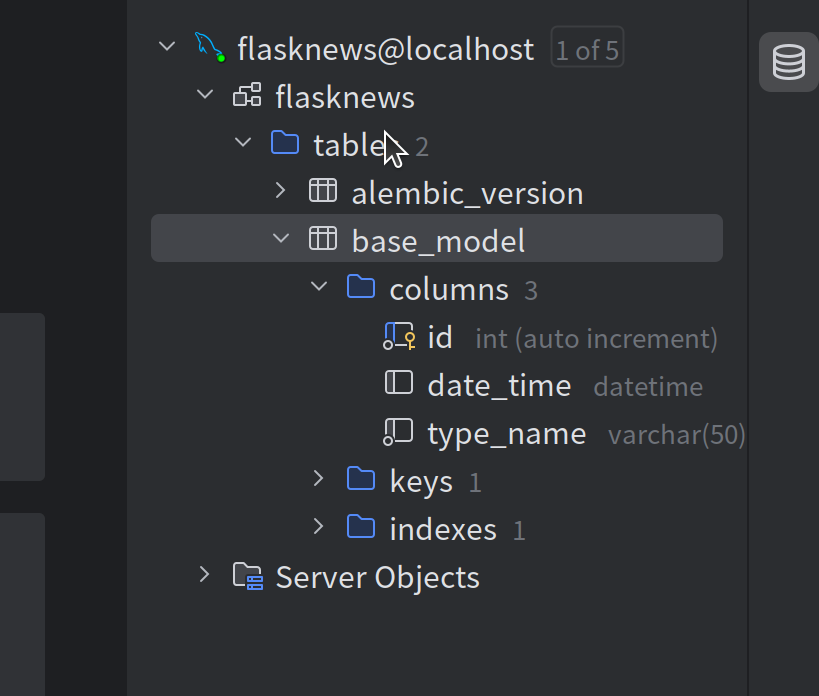
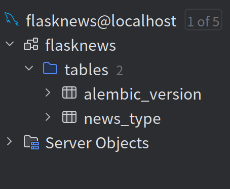
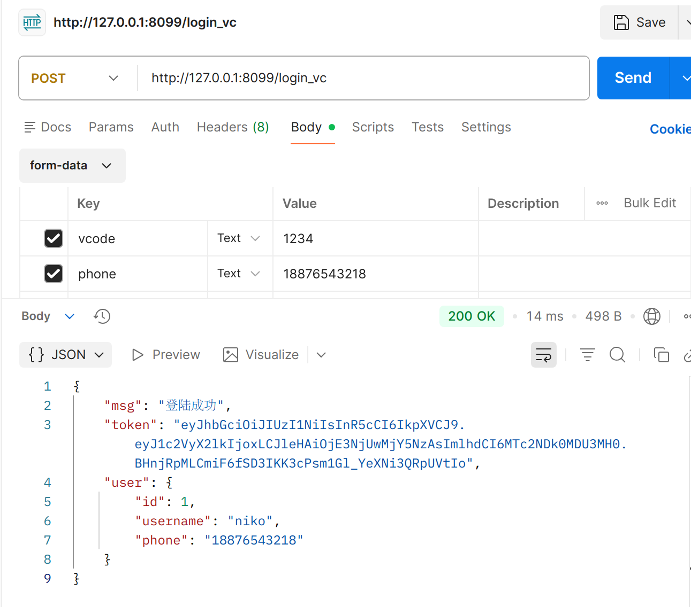

from flask import make_response

## 新闻项目   

### 抽象   
> 设置一个基类，这样可以方便其它orm的模型继承    

```python
from exts.dbhelper import db
from datetime import datetime
class BaseModel(db.Model):
    __abstract__ = True #tips:这里设置的是作为一个抽象类，它就不会作为一个模型单独出现了
    id = db.Column(db.Integer, primary_key=True,autoincrement=True)
    date_time = db.Column(db.DateTime, default=datetime.now)

```  

注意要设置抽象,否则将会创建一个基类表
  
这不是我们想要的，所以一定要加上__abstract__=True   

> 这样之后我们再进行migrate和upgrade，这样就正确了
> 
> 
--- 
### 跨域操作   

- 引入CORS

```python
from flask_cors import CORS
cors = CORS()
```

- 调用并初始化
```python
def create_app():
    app = Flask(__name__)

    app.config.from_object(configdict['default'])
    db.init_app(app)

    #tips:注册蓝图
    app.register_blueprint(news_bp)
    print(app.url_map) #tips:打印一下路由
    cors.init_app(app)
    migrate.init_app(app, db)
    return app
```


### 跨域的另一种操作    
```python
response = make_response()
response.headers['Access-Control-Allow-Origin']='*'
response.headers['Access-Control-Allow-Methods']='GET,POST'
response.headers['Access-Control-Allow-Headers']='x-request-with,Content-type'
``` 
> 这就是对响应头进行操作    
> 这是同源策略，表示接受跨域
> 


### 编写userapi中的验证码登陆功能中的细节
> 最开始由于没有正确的引入.env出现了一些问题

- 为了确保`.env` 能够被正确加载,需要```pip install python-dotenv```  

然后在wsgi.py中引入  
```python
from dotenv import load_dotenv
load_dotenv() #important:确保.env被加载
from apps import create_app

if __name__ == '__main__':
    app = create_app()
    app.run()
```  
### 一些自定义的工具   
- 本项目构造了两个工具，其中一个是用于生成token的 jwt_helper.py  
```python
import jwt
from datetime import datetime,timedelta
from flask import current_app
from settings import Config
#tips:从配置中读取SECRET_KEY
SECRET_KEY = Config.SECRET_KEY
print(SECRET_KEY)
def generate_token(user_id:int)->str:
    payload={
        'user_id':user_id,
        'exp':datetime.utcnow() + timedelta(hours=24), #24小时过期
        'iat':datetime.utcnow(),
    }
    return jwt.encode(payload,SECRET_KEY,algorithm='HS256')

def verify_token(token:str)->dict|None:
    try:
        payload=jwt.decode(token,SECRET_KEY,algorithms=['HS256'])
        return payload
    except jwt.ExpiredSignatureError:
        return None  #过期
    except jwt.InvalidTokenError:
        return None  #无效

```
通过jwthelper我设置了userapi的验证码登陆
```python

#tips:用户登陆和注册
l_and_rParser=parser.copy() #tips:直接用之前定义的parser的copy
l_and_rParser.add_argument('vcode',type=inputs.regex(r'^\d{4}$'),help='必须输入验证码',required=True,location=['form']) #tips:添加一个验证码参数解析

#tips:定制输出
lar_fields={
    'id':fields.Integer,
    'username':fields.String,
    'phone':fields.String
}
class LoginAndRegisterCBV(Resource):
    def post(self):
        args = l_and_rParser.parse_args()
        phone = args.get('phone') #输入手机号
        vcode = args.get('vcode')
        #因为还是没有申请到个人短信api所以只能先用假的了
        if vcode == '1234':
            #tips:验证码通过之后查找数据库中有没有该电话号码，如果有就作登陆处理，否则作注册处理
            user = User.query.filter(User.phone==phone).first()
            if user: #tips:如果有就直接是登陆操作
                #tips:记录登陆状态
                token=generate_token(user_id=user.id)#根据用户id来生成token
                return {
                    'msg':'登陆成功',
                    'token':token,
                    'user':marshal(user,lar_fields) #tips:这里用我们自己设置的输出
                },200
            else:
                #tips:先随机生成一个用户名
                s=''

                new_user=User(phone=phone,vcode=vcode)
                db.session.add(new_user)
                db.session.commit()
                return {'msg':'注册成功'}


        else:
            return {'error':'验证码错误'},400
```


---
