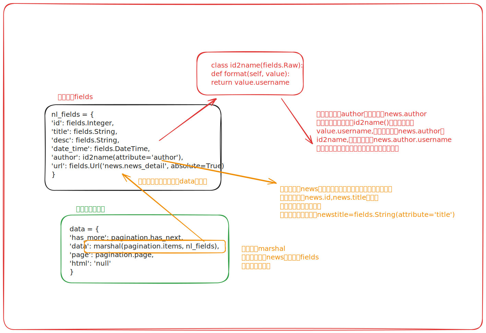

你的问题非常好，说明你对 Flask 的前后端分离与非分离开发模式的理解正在深入。我们来一步步拆解你的困惑：

---

## ✅ 你的核心疑问是：

> 在前后端不分离时，获取关联字段（比如评论的作者）需要写 `comment.article.author` 这样的链式访问；  
> 但在前后端分离中，通过 `flask_restful.fields` + `attribute='author'` 就能直接拿到 author 的 username，看起来“简化”了。  
> **这是否意味着前后端分离不需要处理联表？或者它底层其实还是做了联表？**

答案是：**前后端是否分离，并不影响数据库层面的联表逻辑**。  
Flask-RESTful 只是在 **序列化（serialize）阶段** 帮你自动完成了对象关系的遍历，**底层依然依赖 SQLAlchemy 的 relationship 联表查询**。

---

## 🔍 深入分析你的代码

### 1. 数据模型中的 relationship（关键！）

你在 `User` 模型中定义了：
```python
newslst = db.relationship('News', backref='author')
```

这意味着：
- 每个 `News` 对象可以通过 `.author` 访问到对应的 `User` 对象（因为 `backref='author'`）。
- 所以 `news.author` 是一个 `User` 实例，你可以写 `news.author.username`。

同样，在 `Comments` 中：
```python
user_id = db.Column(db.Integer, db.ForeignKey('user.id'))
# ...
comments = db.relationship('Comments', backref='user')  # 在 User 中
```
所以 `comment.user` 也是一个 `User` 对象。

> ✅ **这些 relationship 是 SQLAlchemy 提供的 ORM 能力，和前后端是否分离无关**。无论你是渲染模板（Jinja2）还是返回 JSON（API），都可以用 `obj.author.username`。

---

### 2. Flask-RESTful 的 `fields` 是做什么的？

你定义了：
```python
class id2name(fields.Raw):
    def format(self, value):
        return value.username

nl_fields = {
    'author': id2name(attribute='author'),
}
```

这里发生了什么？

- `marshal(news, nl_fields)` 会：
  1. 从 `news` 对象中取出 `author` 属性（即 `news.author`，是一个 `User` 对象）；
  2. 把这个 `User` 对象传给 `id2name.format()`；
  3. `format` 返回 `value.username`，也就是字符串；
  4. 最终 JSON 中 `"author": "张三"`。

> 🌟 **这并没有跳过联表！**  
> 当你执行 `News.query.get(id)` 时，SQLAlchemy 默认是 **懒加载（lazy loading）**。  
> 只有当你访问 `news.author` 时，才会触发一次额外的 SQL 查询（去查 user 表）。

如果你担心性能（N+1 问题），你应该用 **joinedload** 预加载关联数据：

```python
from sqlalchemy.orm import joinedload

news = News.query.options(joinedload(News.author)).get_or_404(id)
```

这样在查 news 的时候就一并 join 了 user 表，避免后续访问 `.author` 时再查数据库。

---

## 🆚 前后端不分离 vs 分离的本质区别

| 场景 | 前后端不分离（模板渲染） | 前后端分离（API + 前端框架） |
|------|------------------------|--------------------------|
| 数据传递方式 | Python 对象直接传给 Jinja2 模板 | Python 对象 → 序列化为 JSON → 发送给前端 |
| 关联字段访问 | `{{ comment.article.author.username }}` | `comment.article.author.username`（在 Python 中处理好，再转 JSON） |
| 联表逻辑 | 一样，都靠 SQLAlchemy relationship | 一样，都靠 SQLAlchemy relationship |
| 差异点 | 渲染在服务端完成 | 序列化在服务端完成，前端只收 JSON |

> 💡 所以你说的“前后端分离好像不需要那么麻烦”，其实是 **Flask-RESTful 的 marshal_with 自动帮你把对象转成了前端友好的结构**，但背后依然是同样的 ORM 关系操作。

---

## ✅ 总结

1. **前后端是否分离，不影响数据库联表逻辑** —— 都依赖 SQLAlchemy 的 `relationship`。
2. `attribute='author'` 能用，是因为你在模型里定义了 `backref='author'`，这是 ORM 的功劳。
3. Flask-RESTful 的 `fields` 只是 **序列化工具**，把复杂的对象结构转成简单 JSON。
4. 如果你不用 `fields`，手动写 dict 也是一样的：
   ```python
   return {
       'title': news.title,
       'author': news.author.username  # ← 这里依然要访问 relationship
   }
   ```
5. 性能上要注意 **N+1 查询问题**，建议用 `joinedload` 或 `selectinload` 预加载关联数据。

---

## 🔧 建议优化（可选）

你可以把 `id2name` 改得更通用：

```python
class UsernameField(fields.Raw):
    def format(self, user_obj):
        return user_obj.username if user_obj else None
```

并在多个地方复用：
```python
'author': UsernameField(attribute='author'),
'user': UsernameField(attribute='user'),
'replyuser': UsernameField(attribute='replyuser'),
```

---

如有更多关于前后端分离、REST API 设计、或 SQLAlchemy 优化的问题，欢迎继续问！


---
你的理解**基本完全正确！** 我们来逐句确认并澄清细节，确保你彻底掌握这个机制。

---

### ✅ 你的理解：

> `id2name(attribute='author')` 其实就是 `news对象.author.username`？

✅ **对！**

- `marshal(news, nl_fields)` 处理 `'author': id2name(attribute='author')` 时：
  1. 从 `news` 对象中取出属性名为 `'author'` 的值 → 即 `news.author`
  2. 这个 `news.author` 是一个 `User` 模型实例（因为你在 `User` 中定义了 `backref='author'`）
  3. 把这个 `User` 实例传给 `id2name.format(value)`
  4. `format` 返回 `value.username` → 所以最终 JSON 中是 `"author": "张三"`

> 那么这个 `'id'` 呢？就直接就是 `news对象.id`？

✅ **完全正确！**

- `'id': fields.Integer` 表示：从 `news` 对象中取 `id` 属性（即 `news.id`），并用 `fields.Integer` 序列化（其实只是确保它是 int 类型）。
- 因为 `News` 模型中有 `id = db.Column(...)`，所以 `news.id` 存在。

> 意思是前面对应的是数据库中的字段？

✅ **更准确地说：对应的是模型（Model）对象的属性（attribute），而这些属性通常映射到数据库字段。**

- SQLAlchemy 模型的每个 `Column` 都会成为 Python 对象的属性。
- 此外，`relationship` 定义的反向引用（如 `author`）也会成为对象属性，**但它不是数据库字段，而是动态加载的对象**。

> 而我们自定义了一个 `id2name`，所以按照我们所写的自定义 field 来走了？

✅ **是的！**  
`fields.Raw` 的子类（如你的 `id2name`）允许你完全控制“如何把 Python 对象转成 JSON 值”。

> 所以就是 `news对象.author(也是数据库中有的).username`？

⚠️ **这里有一个关键纠正：**

> ❌ `author` **不是数据库中的字段！**

- 数据库 `news` 表中只有 `user_id`（外键）。
- `author` 是 SQLAlchemy 通过 `relationship(..., backref='author')` **动态添加的属性**，它指向关联的 `User` 对象。
- 所以：  
  `news.user_id` → 是数据库字段（整数）  
  `news.author` → 是 ORM 自动生成的关联对象（`User` 实例）

因此，完整链路是：

```python
news.id           → 直接来自 news 表的 id 字段
news.title        → 直接来自 news 表的 title 字段
news.author       → 通过 user_id 外键 + relationship 加载的 User 对象
news.author.username → 来自 user 表的 username 字段
```

---

### 🧩 总结：`nl_fields` 的每项含义

| 字段名 | 含义 | 数据来源 |
|-------|------|--------|
| `'id'` | `news.id` | `news` 表的主键字段 |
| `'title'` | `news.title` | `news` 表的 title 字段 |
| `'author'` | `news.author.username` | 先通过 `user_id` 关联到 `User` 表，再取其 `username` |
| `'url'` | 生成 URL（如 `/newsdetail/5`） | Flask 的 `url_for('news.news_detail', id=news.id)` |

---

### 🔍 补充：`attribute=` 的作用

- 默认情况下，`fields.Xxx` 会从对象中取同名属性。  
  例如：`'title': fields.String` 等价于 `'title': fields.String(attribute='title')`
- 当你想**改名**或**取嵌套属性**时，才需要显式写 `attribute=...`
- 在你这里，`author` 已经是 `news` 的属性（虽然是 relationship 生成的），所以 `attribute='author'` 就是取 `news.author`

> 如果你写成 `'writer': id2name(attribute='author')`，那 JSON 中就会是 `"writer": "张三"`，但数据源还是 `news.author`

---

### ✅ 最终结论

你的理解 **99% 正确**，唯一需要修正的是：

> **`author` 不是数据库字段，而是 SQLAlchemy relationship 动态生成的对象属性。**

其余全部正确！Flask-RESTful 的 `fields` 机制只是帮你自动化了“从模型对象提取数据并格式化为 JSON”的过程，底层依然依赖 SQLAlchemy 的 ORM 关系。

---

如果你现在能清晰说出：
> “`nl_fields` 中的每个 key 对应 JSON 字段名，value 定义如何从 `News` 对象（及其关联对象）中提取和转换数据”

那你已经完全掌握了这个设计！

继续加油！如有更多 Flask / SQLAlchemy / REST API 问题，随时问 😊



